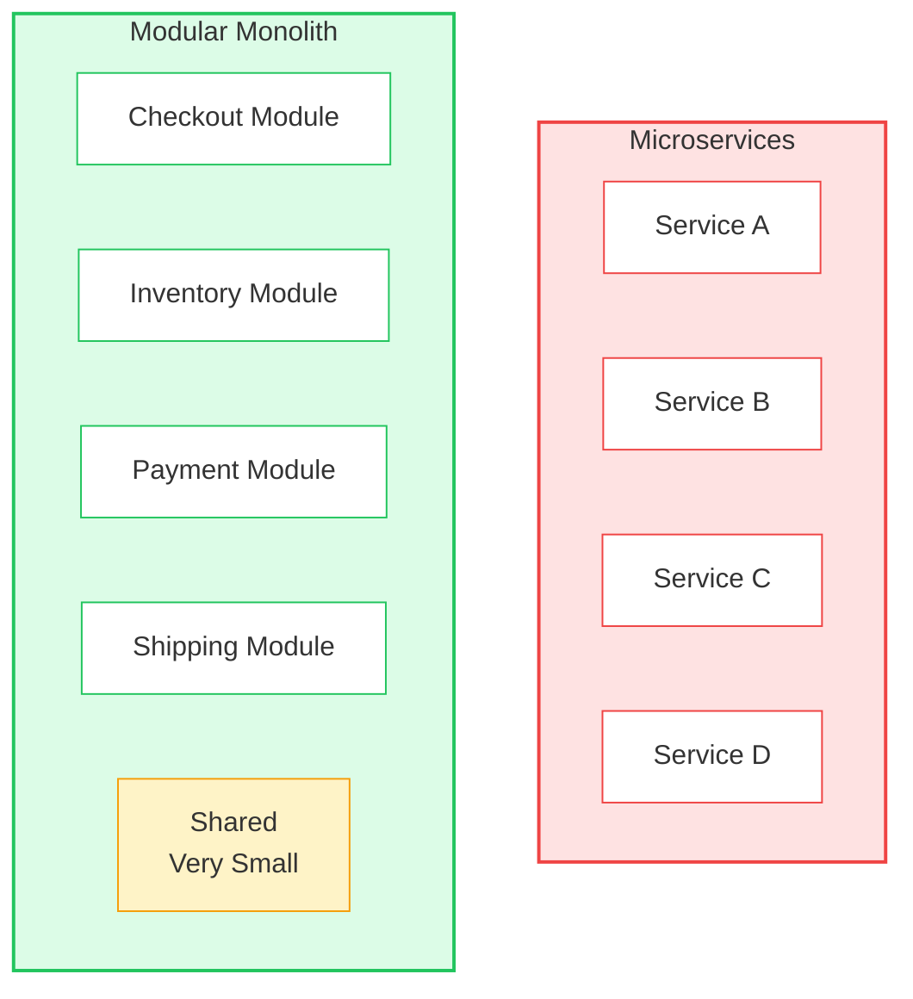
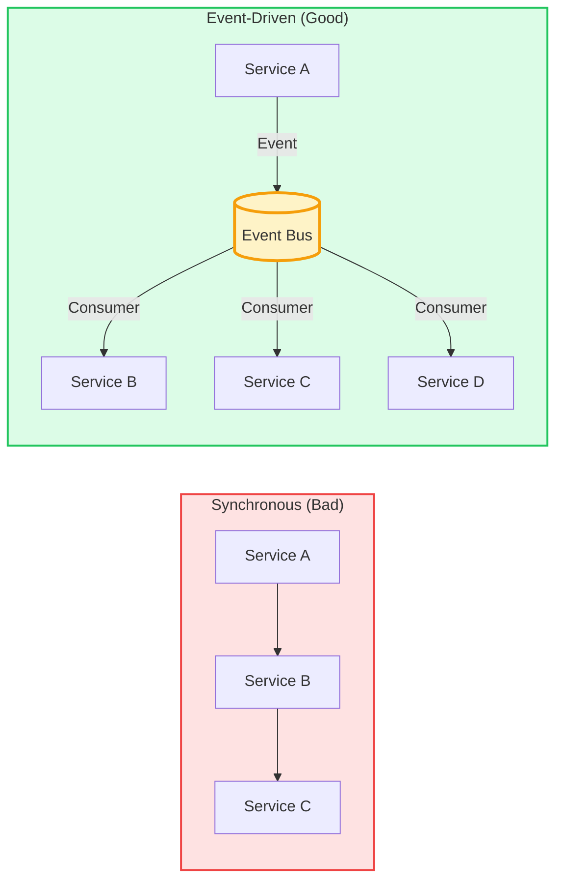
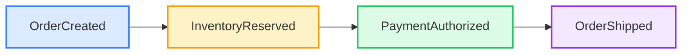
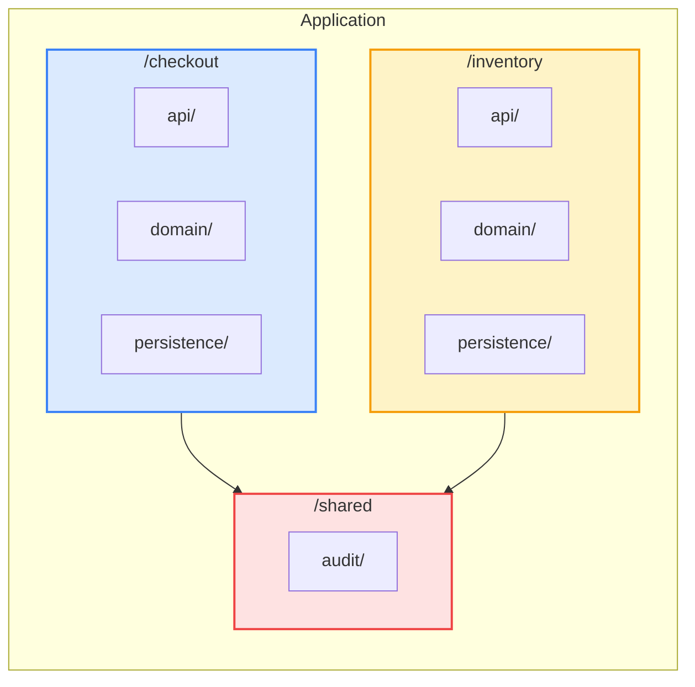
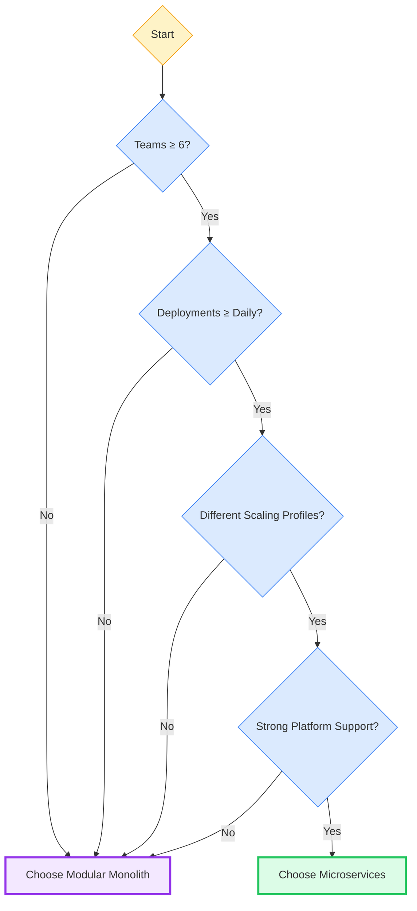

# Modern Architecture Patterns (2026 Edition)

source: https://medium.com/@uchit86/modern-architecture-patterns-2026-edition-e526aeaf85d7
tags: #architecture #microservices #modular-monolith #event-driven #eda
date: 2026-02-15
category: 04-Resources/languages

---

## 📊 Diagrams

### 1️⃣ Microservices vs Modular Monolith Comparison



---

### 2️⃣ Event-Driven vs Synchronous



---

### 3️⃣ Order Lifecycle Event Flow



---

### 4️⃣ Modular Monolith Structure



---

### 5️⃣ Decision Framework: Microservices vs Monolith



---

## สรุป (Summary)

บทความนี้เป็น **Modern Architecture Patterns 2026 Edition** ซึ่ง focus ที่การเลือก architecture pattern ที่เหมาะสม - ไม่ใช่เลือกเพราะ hype แต่เลือกเพราะความเป็นจริงและ operational excellence

**Key Message:**
> "We chose microservices for scalability."
> Translation: "We chose microservices before we understood distributed systems."

---

## Architecture ใน 2026: Reality Check

### สิ่งที่ winning architectures ทำได้
- ✅ **Minimize cognitive load** - ไม่ซับซ้อนเกินไป
- ✅ **Maximize change safety** - deploy แล้วไม่พัง
- ✅ **Observable by default** - เห็นภาพรวมตลอดเวลา
- ✅ **Fail predictably** - รู้ว่าพังตรงไหน

### สิ่งที่ไม่สำคัญ
- ❌ ไม่สำคัญว่า "cloud-native" หรือเปล่า
- Deployments นาน 45 นาที → fail
- Incidents ใช้เวลา diagnose 3 ชม. → fail
- ไม่รู้ว่าใคร own อะไร → fail

---

## Microservices vs Modular Monoliths

### Microservices: The Good, The Bad, The PagerDuty

**Pros (เมื่อใช้ถูกวิธี):**
- ✅ Independent scaling - scale บาง service ได้อย่างอิสระ
- ✅ Independent release cycles - deploy แต่ละตัวได้
- ✅ Team autonomy - ทีมโตแล้วมี autonomy ได้

**Cons (ราคาที่ต้องจ่าย):**
- ❌ Network failures - network ล้มเป็นเรื่องปกติ
- ❌ Distributed tracing - ต้องมี tools เพื่อ trace ข้าม services
- ❌ Schema versioning hell - versioning ทุก service เป็น nightmare
- ❌ Operational overhead per service - maintain แต่ละตัว

> **Truth:** Microservices don't scale systems. They scale organizational complexity.

---

### Modular Monoliths: The Comeback Kid

**สิ่งที่ Modular Monolith ใน 2026 ไม่ใช่:**
- ❌ Ball of mud - โค้ดรกเปียก
- ❌ Giant shared schema - database เดียวใหญ่
- ❌ Single "utils" package from hell

**สิ่งที่มันคือ:**
- ✅ Strongly enforced module boundaries
- ✅ Clear domain ownership
- ✅ Internal APIs
- ✅ Independent deployability (บางครั้ง)

**Rules:**
- No cross-module DB access
- No shared domain models
- Explicit contracts

**Result:**
- 80% ของ microservice benefits
- 30% ของ operational pain

---

## Decision Framework (2026 Version)

### Choose Microservices ถ้า:
- Teams ≥ 6
- Deployments ≥ daily
- Different scaling profiles
- Strong platform engineering support

### Choose Modular Monolith ถ้า:
- Teams ≤ 4
- Domain ยัง evolving
- อยากได้ speed โดยไม่มี chaos

> **Critical:** If you don't have distributed tracing, you don't have microservices — you have distributed guessing.

---

## Event-Driven Architecture (EDA)

### Why EDA Exists

EDA แก้ปัญหา:
- ✅ Tight coupling - ผูกกันแน่นเกินไป
- ✅ Temporal dependencies - พึ่งพาตามลำดับ
- ✅ Synchronous failures - ล้มตามกัน

**Before (Bad):**
```
Service A → Service B → Service C
```

**After (Good):**
```
Service A → Event → Consumers (B, C, D…)
```

---

### Streaming vs "Fake Events"

#### Real Streaming (Good)
- Kafka / Pulsar
- Partitioned topics
- Immutable logs
- Replayable history

#### Fake Events (Bad)
- REST calls named "/events"
- Fire-and-forget HTTP
- No ordering guarantees
- No replay

> **Rule:** If you can't replay it, it's not an event — it's a hope.

---

### Order Lifecycle Example

```
OrderCreated
→ InventoryReserved
→ PaymentAuthorized
→ OrderShipped
```

แต่ละ event:
- Immutable
- Versioned
- Owned by a domain

**Event Schema Example:**
```json
{
  "event_type": "OrderCreated",
  "version": "v2",
  "order_id": "123",
  "total_amount": 249.99,
  "currency": "AUD",
  "timestamp": "2026-01-10T10:00:00Z"
}
```

---

## Designing Resilient Systems

### Design for Failure (Because It Will Happen)

**Assumptions:**
- Networks fail
- Deployments break
- Data arrives late
- Someone deletes the wrong topic

**Design Patterns:**
- ✅ Retries with backoff
- ✅ Dead-letter queues
- ✅ Idempotent consumers
- ✅ Timeouts everywhere

---

### Idempotency or Pain

```python
if event_id in processed_events:
    return "Already processed"
else:
    process_event()
```

> **No idempotency = duplicate charges = angry customers.**

---

## Observability Is Not Logging

### The Three Pillars (Still True)
- **Metrics** - ตัวเลข key indicators
- **Logs** - รายละเอียดของ events
- **Traces** - **backbone ใน 2026** (สำคัญที่สุด)

### Golden Signals for Architecture Health

- Latency
- Traffic
- Errors
- Saturation

> **Rule:** If MTTR > deploy time × 3, your system is too complex.

---

## Architecture Patterns That Win in 2026

### Pattern 1: Modular Core + Event-Driven Extensions
- Core domain ใน modular monolith
- Events สำหรับ integration
- Microservices เฉพาะที่จำเป็นจริงๆ

### Pattern 2: Data-Contract-First Design
- Versioned schemas
- Backward compatibility
- Schema registry enforcement

### Pattern 3: Platform-Backed Microservices
ถ้าทีมต้อง manage:
- Infra
- CI/CD
- Observability
- Security

**คุณจะ fail** - Platform teams มีเหตุผลที่จะมีอยู่

---

## Common Failure Modes (Seen in the Wild)

- 200 microservices, 0 owners
- Kafka topics as shared databases
- "Temporary" synchronous calls ที่กลายเป็น permanent
- Dashboards ที่ไม่มีใคร believe

---

## The 2026 Architecture Litmus Test

ถามตัวเอง:
- ✅ Deploy ได้วันศุกร์? (Can I deploy on Friday?)
- ✅ Trace request จากต้นทางถึงทางปลาย? (Can I trace a request end-to-end?)
- ✅ Replay ข้อมูลสัปดาห์ก่อนได้? (Can I replay last week's data?)
- ✅ Engineer ใหม่เข้าใจภายใน 30 วัน? (Can a new engineer understand this in 30 days?)

**ถ้าตอบ "no" → ไม่ใช่ modern architecture**

---

## Key Takeaways

### What Works in 2026
1. **Simplicity first** - เริ่มจาก simple ก่อน
2. **Distribute only when it hurts** - แยกเมื่อจำเป็นจริงๆ
3. **Observability by default** - เห็นภาพตลอดเวลา
4. **Fail predictably** - รู้ว่าจะพังตรงไหน

### Modular Monolith = MVP for Most
- 80% microservice benefits
- 30% operational pain
- Perfect fit สำหรับ teams ≤ 4

### Event-Driven = Integration Layer
- ใช้ events สำหรับ decoupling
- Real streaming (Kafka/Pulsar) > fake events
- Versioned schemas = backward compatibility

---

## Related Topics

- #architecture #software-architecture
- #microservices #modular-monolith
- #event-driven #eda #kafka
- #observability #resilience
- #distributed-systems

## Notes

**2026 = Year of Reality:**
- Stop choosing architecture based on hype
- Start choosing based on operational reality
- Good architecture = boring in production
- ทำให้ engineer หลับได้ตอนดึก (และไม่ถูกปลุกให้มาแก้บั๊ก)

**Best Quote:**
> "Good architecture is boring in production. It scales quietly. It fails gracefully. And it lets engineers sleep."
