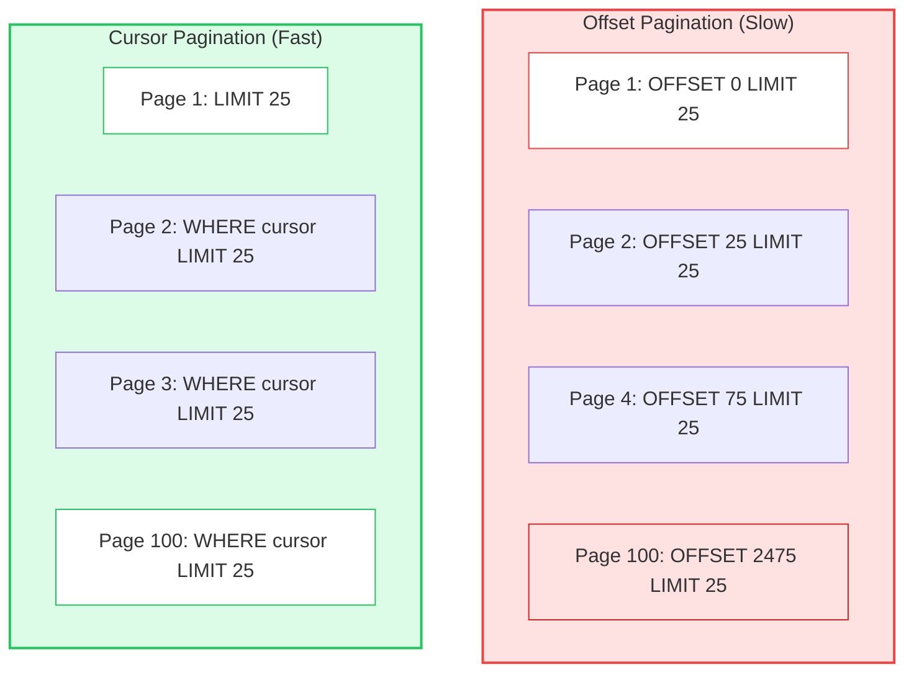
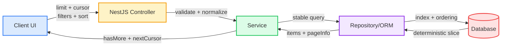
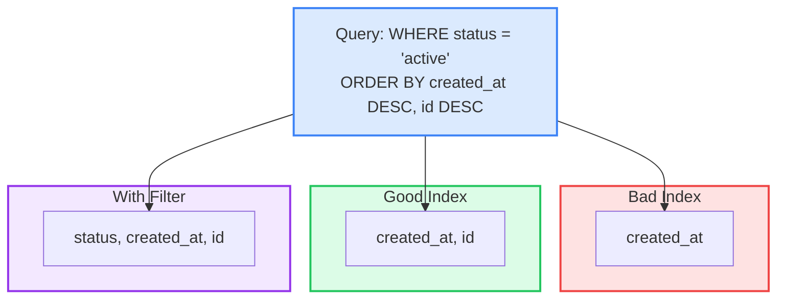
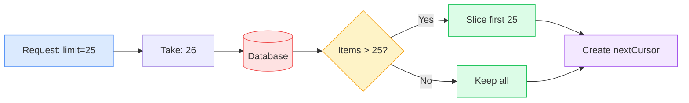

# Pagination in NestJS: Fast Pages, Happy Users

source: https://medium.com/@Modexa/pagination-in-nestjs-fast-pages-happy-users-812d8d457c7f
tags: #nestjs #pagination #backend #performance #database
date: 2026-02-15
category: 04-Resources/languages

---

## 📊 Diagrams

### 1️⃣ Offset vs Cursor Pagination



---

### 2️⃣ Pagination Architecture Flow



---

### 3️⃣ Cursor Encoding Flow

```mermaid
graph LR
    ITEM[Last Item<br/>createdAt: 2026-01-27<br/>id: 1001]
    ENC[encodeCursor]
    JSON[JSON Stringify]
    BASE64[Base64URL Encode]
    CURSOR[cursor: eyJjcmVhdGVkQXQi...]

    ITEM --> ENC
    ENC --> JSON
    JSON --> BASE64
    BASE64 --> CURSOR

    DEC[decodeCursor]
    PARSE[JSON Parse]
    RAW[Base64URL Decode]
    OBJ[{createdAt, id}]

    CURSOR --> RAW
    RAW --> PARSE
    PARSE --> OBJ
    OBJ --> DEC

    style ENC fill:#dbeafe,stroke:#3b82f6
    style DEC fill:#dcfce7,stroke:#22c55e
    style CURSOR fill:#fef3c7,stroke:#f59e0b,stroke-width:2px
```

---

### 4️⃣ Database Index Strategy



---

### 5️⃣ Limit + 1 Pattern for hasMore



---

## สรุป (Summary)

บทความนี้สอน **Pagination ใน NestJS** ที่ทั้ง **fast** และ **correct** - ไม่ใช่แค่ split results แต่ focus ที่ ordering, stability, และ time

**Key Message:**
> Pagination looks easy... until your table gets filters, users sort by "latest," someone adds infinite scroll — and suddenly your backend is doing heavy squats on every request.

---

## The Two Pagination Models

### 1️⃣ Offset Pagination (page/limit)

**Example:**
```
GET /orders?page=4&limit=25
```

**SQL:**
```sql
ORDER BY created_at DESC
OFFSET 75
LIMIT 25
```

**Pros:**
- ✅ Easy to understand
- ✅ Familiar pattern
- ✅ Jump to any page

**Cons:**
- ❌ Gets SLOWER with every new row (DB walks past skipped rows)
- ❌ Performance degrades on deep pages
- ❌ Breaks with inserts/deletes (duplicates, missing items)

**When to use:**
- Small datasets
- Rarely go beyond a few pages
- Results don't change much
- Relaxed performance requirements

---

### 2️⃣ Cursor Pagination (keyset pagination)

**Example:**
```
GET /orders?limit=25&cursor=eyJjcmVhdGVkQXQiOiIyMDI2LTAxLTI3VDA5OjAwOjAwLjAwMFoiLCJpZCI6IjEwMDEifQ==
```

**SQL:**
```sql
WHERE (created_at, id) < (:createdAt, :id)
ORDER BY created_at DESC, id DESC
LIMIT 25
```

**How it works:**
Instead of counting "how many rows to skip," you say: **"continue after this last item"**

**Pros:**
- ✅ Consistent performance (O(log n) with index)
- ✅ Handles inserts gracefully (no duplicates/missing)
- ✅ Perfect for infinite scroll
- ✅ Fast on large datasets

**Cons:**
- ❌ Cannot jump to arbitrary pages
- ❌ Slightly more complex implementation

**When to use:**
- ✅ Infinite scroll
- ✅ Frequently updated lists
- ✅ Large datasets (millions of rows)
- ✅ Consistent p95 latency required

---

## Architecture Flow

Pagination is **not just a controller concern** — it's a **contract across the stack**:

```
Client UI
  → sends: limit + cursor (or page) + filters + sort
  → expects: items + pageInfo (nextCursor/hasMore)

NestJS Controller
  → validates query + normalizes defaults

Service
  → builds a stable pagination query

Repository/ORM
  → uses correct index + stable ordering

Database
  → returns deterministic slice

Client UI
  → merges without duplicates or gaps
```

**If any layer "assumes" ordering is stable without enforcing it, you'll ship broken UX.**

---

## The Hidden Rule: Pagination Requires Stable Sorting

**#1 Cause of duplicates/missing items**

### ❌ Bad (Unstable):
```sql
ORDER BY created_at DESC
```
Rows with equal timestamps can shuffle between requests, especially under concurrency. Your UI might see item #A on page 1, then again on page 2 — or never.

### ✅ Good (Stable):
```sql
ORDER BY created_at DESC, id DESC
```
**Always include a tie-breaker with a unique column!**

Cursor pagination **must** include the same ordering fields in the cursor.

---

## NestJS Implementation

### 1) DTO: Validate limit + cursor + sort

```typescript
import { IsInt, IsOptional, IsString, Max, Min } from 'class-validator';
import { Type } from 'class-transformer';

export class OrdersPageQueryDto {
  @Type(() => Number)
  @IsInt()
  @Min(1)
  @Max(100)
  limit = 25;

  @IsOptional()
  @IsString()
  cursor?: string; // base64 JSON of { createdAt, id }

  @IsOptional()
  @IsString()
  status?: string; // example filter
}
```

---

### 2) Cursor Helpers (encode/decode)

```typescript
type OrdersCursor = { createdAt: string; id: string };

export function encodeCursor(c: OrdersCursor): string {
  return Buffer.from(JSON.stringify(c), 'utf8').toString('base64url');
}

export function decodeCursor(cursor: string): OrdersCursor {
  const raw = Buffer.from(cursor, 'base64url').toString('utf8');
  const parsed = JSON.parse(raw);
  if (!parsed?.createdAt || !parsed?.id) throw new Error('Invalid cursor');
  return parsed;
}
```

---

### 3) Controller

```typescript
import { Controller, Get, Query } from '@nestjs/common';

@Controller('orders')
export class OrdersController {
  constructor(private readonly ordersService: OrdersService) {}

  @Get()
  async list(@Query() q: OrdersPageQueryDto) {
    return this.ordersService.listOrders(q);
  }
}
```

---

### 4) Service: Stable Ordering + "limit + 1" Pattern

**The limit+1 trick** helps determine `hasMore` without expensive counts.

```typescript
import { Injectable } from '@nestjs/common';
import { decodeCursor, encodeCursor } from './cursor';

@Injectable()
export class OrdersService {
  constructor(private readonly repo: OrdersRepository) {}

  async listOrders(q: OrdersPageQueryDto) {
    const take = q.limit + 1;

    const cursor = q.cursor ? decodeCursor(q.cursor) : null;

    const rows = await this.repo.findPage({
      take,
      cursor,
      status: q.status,
    });

    const hasMore = rows.length > q.limit;
    const items = hasMore ? rows.slice(0, q.limit) : rows;

    const nextCursor = hasMore
      ? encodeCursor({
          createdAt: items[items.length - 1].createdAt.toISOString(),
          id: items[items.length - 1].id,
        })
      : null;

    return {
      items,
      pageInfo: {
        hasMore,
        nextCursor,
      },
    };
  }
}
```

---

### 5) Repository: Keyset Query (createdAt + id)

```typescript
type PageArgs = {
  take: number;
  cursor: { createdAt: string; id: string } | null;
  status?: string;
};

export class OrdersRepository {
  constructor(private readonly ormRepo: any) {}

  async findPage(args: PageArgs) {
    const qb = this.ormRepo.createQueryBuilder('o');

    if (args.status) qb.andWhere('o.status = :status', { status: args.status });

    qb.orderBy('o.created_at', 'DESC')
      .addOrderBy('o.id', 'DESC')
      .limit(args.take);

    if (args.cursor) {
      qb.andWhere(
        `(o.created_at, o.id) < (:createdAt, :id)`,
        { createdAt: args.cursor.createdAt, id: args.cursor.id },
      );
    }

    return qb.getMany();
  }
}
```

**This is the "real" pagination logic:**
- ✅ Stable ordering
- ✅ Tie-breaker included
- ✅ Cursor uses the same fields

---

## Performance: Why Offset Gets Slow

### Offset Pagination
Deep pages force DB to step over rows:
- Page 1: Read 25 rows
- Page 4: Skip 75, read 25
- Page 100: Skip 2475, read 25

**Even with index, skipping isn't free.**

### Cursor Pagination
Stays fast because it uses index to jump directly near the target boundary.

---

## The Index That Actually Helps

### For Sort: `created_at DESC, id DESC`
**PostgreSQL:**
```sql
INDEX on (created_at DESC, id DESC)
-- or just (created_at, id) with planner usage
```

**MySQL:**
```sql
INDEX on (created_at, id)
```

### With Filter: `status = 'active'`
Consider:
```sql
INDEX on (status, created_at, id)
```

**Filter columns matter!** Common filter + sort combinations benefit from composite indexes.

---

## UX Pitfalls (And How to Avoid Them)

### 1) The "count(*)" Trap

**Frontends love page counts. Backends hate them.**

`COUNT(*)` on large filtered datasets = expensive + bottleneck under load.

**Alternatives:**
- Show "Load more" instead of "Page 1 of 500"
- Show approximate counts (cached, pre-aggregated)
- Compute counts asynchronously

---

### 2) Filters + Cursor Must Travel Together

If UI changes filters but keeps old cursor → **nonsense results**

**Cursor is only valid for:**
- Specific filter set
- Specific sort order
- Specific query shape

**Best practice:** Treat cursor as **opaque** and invalidate when filters/sort changes.

---

### 3) Deletions and Insertions Are Normal

In live systems, rows insert while someone scrolls. **That's not a bug.**

Your pagination must NOT duplicate or skip due to unstable sorting.

**This is why stable ordering with tie-breaker matters.**

---

## Real Production Pattern: "Seek Pagination" for Infinite Scroll

Think of cursor pagination like a bookmark:

1. UI requests first page (no cursor)
2. UI receives items + nextCursor
3. UI requests next page using that cursor
4. UI appends items, **dedupes by id (always)**

**Bonus UX trick:** For infinite scroll, dedupe on client by id anyway. It's cheap insurance.

---

## Key Takeaways

### ✅ Start with Cursor Pagination
- Better default for modern apps
- Consistent performance
- Handles real-time data gracefully

### ✅ Enforce Stable Ordering
```sql
ORDER BY created_at DESC, id DESC
```
Always include tie-breaker!

### ✅ Use "Limit + 1" Pattern
```typescript
const take = q.limit + 1;
const hasMore = rows.length > q.limit;
```
Avoid expensive `COUNT(*)` queries.

### ✅ Design Around Real UI Behavior
- Infinite scroll → cursor pagination
- Arbitrary page jumps → offset pagination (if dataset small)
- Always dedupe by id on client

### ✅ Match Index to Query
```sql
INDEX on (status, created_at, id)
```
For: `WHERE status = ? ORDER BY created_at DESC, id DESC`

---

## Related Topics

- #nestjs #backend #pagination
- #database #performance #optimization
- #sql #typeorm #prisma
- #api-design #ux
- #infinite-scroll

## Notes

**Pagination = Contract, Not Parameter:**

Good pagination is invisible. It makes your app feel:
- Smooth
- Predictable
- "Fast enough" even under load spikes

Bad pagination turns into:
- Slow endpoints
- Angry users
- Duplicate/missing items
- Mysterious bugs on page 37

**Start with cursor pagination by default, enforce stable ordering, and design around real UI behavior.**
