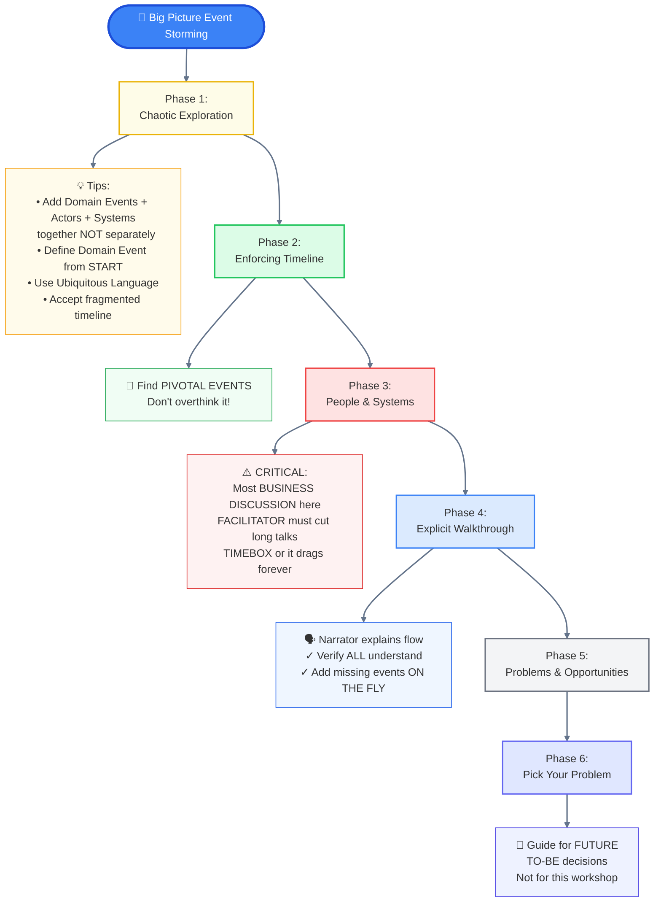
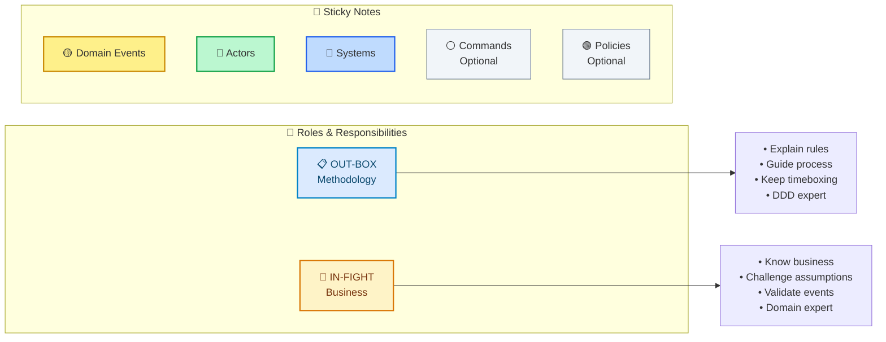
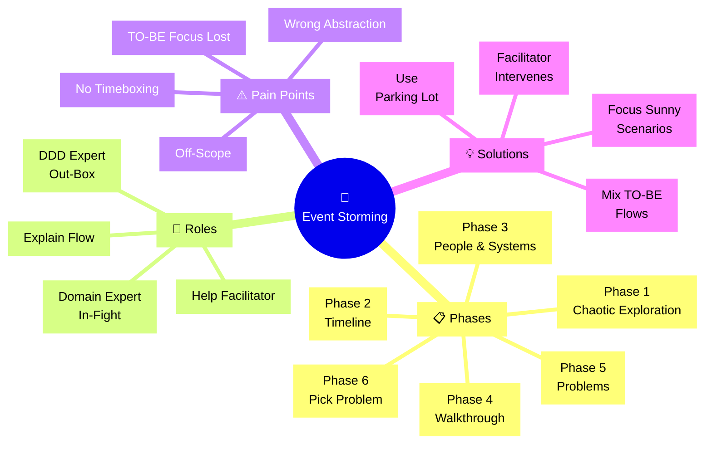
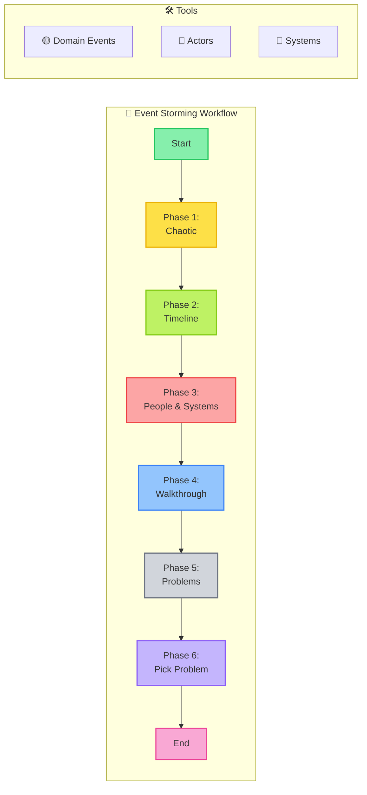

# Practical DDD: Big Picture Event Storming

source: https://medium.com/@armyost1/practical-ddd-breaking-free-from-theory-1-big-picture-eventstorming-f796f614b364
tags: #ddd #eventstorming #domain-driven-design #workshop
date: 2026-02-15
category: 04-Resources/languages

## สรุป (Summary)

บทความนี้แชร์ประสบการณ์จริงเกี่ยวกับ **Domain-Driven Design (DDD)** และ **Big Picture Event Storming** โดยเน้นที่การใช้งานจริงมากกว่าทำตาม theory อย่างเคร่งครัด

ประเด็นสำคัญ: DDD หลายๆ ที่ทำกันมัก focus แค่ solution space และใช้ Event Storming เป็นแค่ prelude สำหรับ TO-BE System Design ซึ่งผิดจากจุดประสงค์เดิม

---

## แนวคิดหลัก (Core Concepts)

### สิ่งที่ DDD ควรทำจริงๆ
- เข้าใจระบบปัจจุบัน (Current System) ให้ถูกต้อง
- ให้ solution ที่ sustainable ตามความเข้าใจนั้น
- ไม่ใช่แค่ design TO-BE system เฉยๆ

### ปัญหาของ DDD ในองค์กร Pivotal
- เน้นแค่ solution space
- Event Storming เหลือแค่ form ไม่มี essence
- ทุกขั้นตอนมีไว้เตรียมสำหรับ TO-BE System Design เท่านั้น

---

## Big Picture Event Storming

### การแบ่ง Role

**หลักการตามหนังสือ:**
- **Facilitator** - ดูแล progress ทั้งหมด แนะนำให้ focus จุดที่ถูก
- **Supporter** - ช่วย Facilitator ให้ workshop ลื่นไหล
- **Narrator** - อธิบาย walkthrough ตรวจสอบว่าทุกคนเข้าใจ

**จริงที่ใช้ (Practical approach):**
- **Out-Box** (อธิบาย methodology) → คนที่รู้ DDD process เป็นดี
- **In-Fight** (ถกทำกันจริง) → คนที่รู้ business เป็นดีที่สุด

> ถ้าใครไม่รู้ business จริงๆ ก็ทำให้ process เดินหน้าไม่ได้

### Sticky Notes ที่ใช้
- Domain Events
- Actors
- Systems
- Commands (optional)
- Policies (optional)

---

## Workshop Phases - Tips และ Pain Points

### Phase 1: Chaotic Exploration
**Tips:**
- ✅ **ข้ามไป Phase 2/3 เลย** - ไม่ต้อง layout Domain Events แค่นั้น เพราะวนกลับมา add Actor/System ใหม่ก็เสียเวลา
- ✅ **นิยาม Domain Event ชัดเจน** ตั้งแต่แรก
- ✅ **ใช้ Glossary + Ubiquitous Language** ให้ทุกคนใช้คำเหมือนกัน
- ✅ **มี Icebreaker** เมื่อเกิดความเงียบ
- ✅ **ยอมรับว่า timeline จะขาดๆ ต่อๆ** อยู่ก่อน - จัดให้ใน phase ต่อไป

### Phase 2: Enforcing the timeline
- หา Pivotal Events (events สำคัญๆ)
- อย่าใช้เวลานานไปกับการหา pivotal events ที่ perfect

### Phase 3: People and Systems
- **Critical** - Facilitator ต้องมี leadership skills เพื่อตัด discussion ยาวๆ
- ถ้าไม่มีคนคุม discussion จะยืดเวลามาก

### Phase 4: Explicit Walkthrough
- Narrator อธิบาย flow ทั้งหมด
- ถ้า narrator พูดรู้สึกว่ามีอะไรขาด - สามารถ add sticky ได้เลยระหว่างทาง

### Phase 5: Problems & Opportunities
- ไม่มีอะไรพิเศษ

### Phase 6: Pick Your Problem
- Guide สำหรับการตัดสินใจ TO-BE system ในอนาคต
- ไม่ใช่สำหรับ Event Storming ครั้งนี้โดยตรง

---

## เกร็ดเคล็ดลับ (Practical Tips)

### Domain Events
**Definition:** Events ที่ capture changes ซึ่งสามารถ trigger actions หรือ state changes ต่อได้

**หลีกเลี่ยง:**
- Physical event
- Technical term
- Condition-like event

### Ubiquitous Language
- ให้คนใช้คำเหมือนกันหมด
- Business terms → เป็น Ubiquitous Language ได้เลย

### Discussion Management
**อย่า discuss เรื่อง:**
- Rainy scenarios มากเกินไป (ใช้ sunny scenario main)
- Edge cases ที่เกิดได้ยากมากๆ (เช่น ticket หาย)

**Tip:** ถ้า process เหมือนกัน แต่ object ต่างกัน → ใช้ Domain Event เดียวได้

---

## Pain Points จากการใช้งานจริง

1. **ขาด Timeboxing** → Discuss นานเกินไป
   - Solution: Focus บน Sunny Scenario มากกว่า Rainy

2. **TO-BE discussions ทำให้ focus หาย**
   - คนเริ่มเบื่อเมื่อเวลาผ่านไป
   - Solution: ต้องมี TO-BE event flow + system updates บ้าง

3. **Discussions ออกนอก scope หรือผิด abstraction level**
   - Solution: ถ้า discuss นานเกินไป → ใส่ไว้ใน Parking Lot

---

## Key Takeaways

**ถ้าจะทำ DDD ให้ได้ผล:**
1. Focus ที่การเข้าใจ business ปัจจุบัน (not just TO-BE)
2. Facilitator ต้องรู้ DDD process แต่คนใน business ต้องช่วยกัน
3. Timebox discussions ให้ดี
4. ใช้ Sunny Scenario เป็นหลัก
5. Define Domain Events ชัดเจนตั้งแต่แรก
6. เปลี่ยน language ให้เป็น Ubiquitous Language

---

## Related Topics

- #ddd #domain-driven-design
- #eventstorming
- #workshop-facilitation
- #ubiquitous-language
- #agile

## Notes

บทความนี้เน้น practical experience มากกว่า theory ซึ่งเป็นประโยชน์มากสำหรับคนที่จะลองทำ Event Storming จริงๆ ใน org
