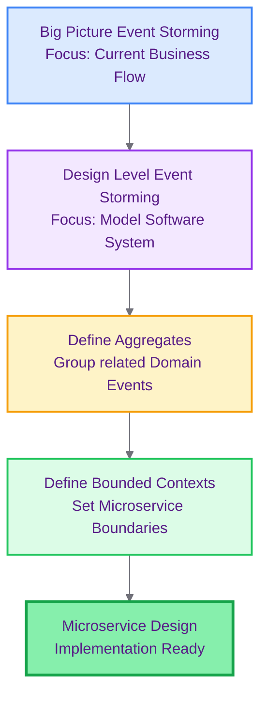
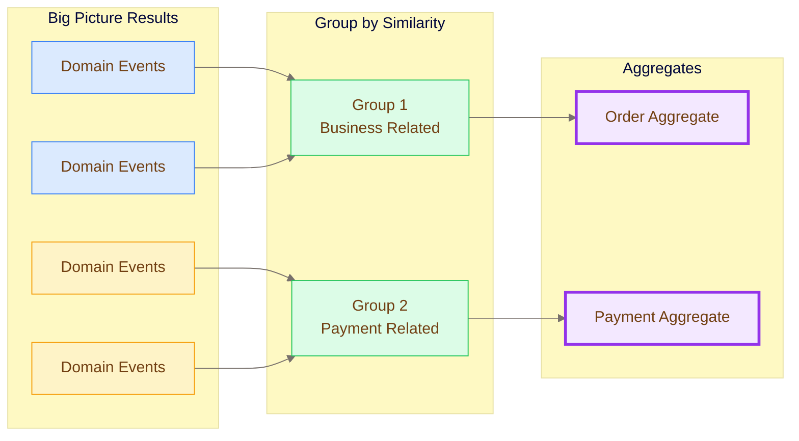
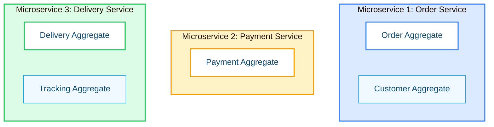
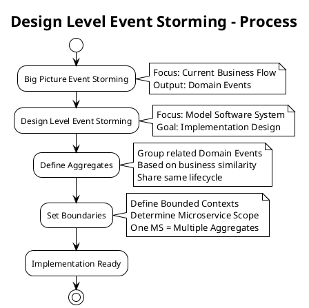

# Practical DDD: Design Level Event Storming

source: https://medium.com/@armyost1/practical-ddd-breaking-free-from-theory-2-design-level-event-storming-a4b494e61f9f
tags: #ddd #eventstorming #design-level #bounded-context #microservices
date: 2026-02-15
category: 04-Resources/languages

## 🎨 Theme Configuration

```yaml
theme: base
themeVariables:
  primaryColor: "#faf5ff"
  primaryTextColor: "#581c87"
  primaryBorderColor: "#9333ea"
  lineColor: "#71717a"
  secondaryColor: "#fff7ed"
  tertiaryColor: "#f3e8ff"
  background: "#ffffff"
  fontSize: "14px"
```

---

## 📊 Diagrams

### 1️⃣ Big Picture → Design Level Flow



---

### 2️⃣ Aggregate Definition Process



---

### 3️⃣ Microservice Architecture



---

### 4️⃣ Design Level Process (PlantUML)



---

## สรุป (Summary)

บทความนี้เป็น **Part 2** ของ series Practical DDD ซึ่ง focus ที่ **Design Level Event Storming** - ขั้นตอนต่อจาก Big Picture Event Storming ที่มุ่ง modeling software system เพื่อการ implement

**ความแตกต่างหลัก:**
- **Big Picture** → Focus ที่ business flow ปัจจุบัน
- **Design Level** → Focus ที่ model software system เอง

---

## แนวคิดหลัก (Core Concepts)

### สิ่งที่ Design Level ทำ
- Model software system สำหรับ implementation
- อาจทำให้ definition เดิมเปลี่ยนไป
- ตัดสินใจเรื่อง microservice boundaries

### ตัวอย่างการเปลี่ยนแปลง
1. **Decouple Systems** - แยก Payment System ออกจาก Delivery System monolith
2. **Absorb Manual Tasks** - งานที่ทำ manual เข้ามาใน system

---

## Aggregates - จุดเปลี่ยนคริติคัล

### Definition
**Aggregate** = การรวมกลุ่ม Domain Events ที่มี **similarities** หรือ **strong relationship**

### ทำไมต้อง Aggregate?
จากผลลัพธ์ Big Picture Event Storming:
- Domain Events บางอันตอนแรกคิดว่าอยู่คนละ system
- แต่ด้วย **business similarity** → ควรอยู่ **ใน Aggregate เดียวกัน**

### Aggregate ใน Code
- จะกลายเป็น **Objects** ที่ share **same Lifecycle**
- Implement ผ่าน **OOP (Object-Oriented Programming)** concepts
- เป็น **core objects** ภายใน microservice

---

## Bounded Contexts & Microservices

### ขั้นตอน
1. **Define Aggregates** ก่อน (จาก Big Picture results)
2. **Define Bounded Contexts** (อิงจาก Aggregates)
3. **Determine Microservice Scope**

### General Rule
```
1 Microservice = Multiple Aggregates (as core objects)
```

### Importance
- **Bounded Contexts** ใช้ define organizational structures
- ใช้ determine **appropriate size of Microservices**
- Carve ออกเป็น Bounded Contexts ได้ **precise** ไม่ง่าย

### เพื่อความ precise
ต้อง **enhance visibility of Event Storming output** → นั่นคือเหตุผลที่ต้อง define **Aggregate ก่อน Bounded Context**

---

## Key Takeaways

**Aggregates เป็น Turning Point:**

**Macro Level (Design):**
- Improve visibility เมื่อ define Bounded Contexts
- ช่วย determine microservice boundaries

**Micro Level (Code):**
- เป็น **most critical object** ภายใน code
- Share same lifecycle
- Core objects ของ microservice

**Process Flow:**
```
Big Picture Events
    ↓
Group by Similarity
    ↓
Define Aggregates
    ↓
Define Bounded Contexts
    ↓
Determine Microservice Scope
```

---

## Related Topics

- #ddd #domain-driven-design
- #eventstorming #design-level
- #bounded-context #microservices
- #aggregates #oop
- #software-architecture

## Notes

Design Level Event Storming เป็น **bridge** ระหว่าง business understanding (Big Picture) กับ implementation design (Tactical Design) - Aggregates เป็น key concept ที่เชื่อมทั้งสองโลกนี้เข้าด้วยกัน
