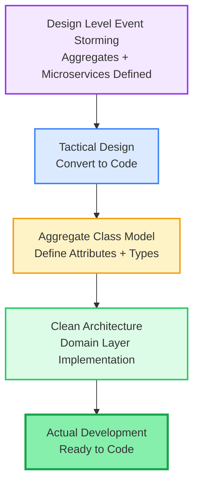
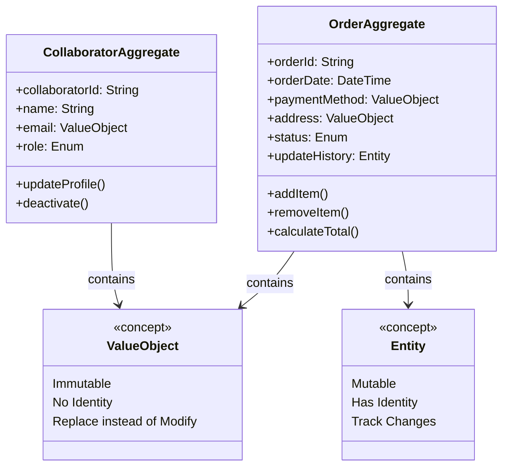
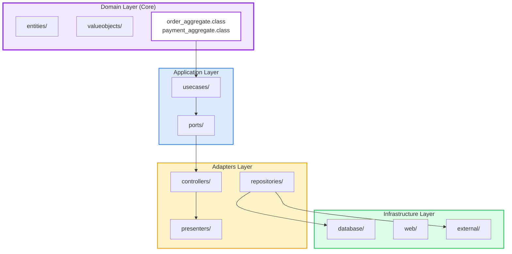
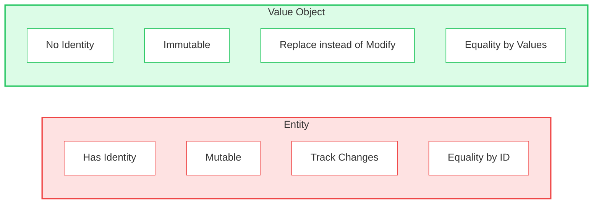

# Practical DDD: Tactical Design

source: https://medium.com/@armyost1/practical-ddd-breaking-free-from-theory-3-tactical-design-da203905c793
tags: #ddd #tactical-design #clean-architecture #aggregates #entities
date: 2026-02-15
category: 04-Resources/languages


## 📊 Diagrams

### 1️⃣ Design Level → Tactical Flow



---

### 2️⃣ Aggregate Class Model Example



---

### 3️⃣ Clean Architecture Structure



---

### 4️⃣ Entity vs Value Object



---

## สรุป (Summary)

บทความนี้เป็น **Part 3** สุดท้ายของ series Practical DDD ซึ่ง focus ที่ **Tactical Design** - ขั้นตอนการแปลงผลจาก Design Level Event Storming ให้กลายเป็น code จริง

**Context:**
- Tactical Design มาจาก DDD original concepts
- Event Storming ไม่ได้ define explicitly ว่าอะไรคือ Tactical Design
- แต่มี tendency มองว่า **Solution Phase elements** คือ Tactical Design

---

## Aggregate Class Model

### สิ่งที่ต้องทำ
1. **Design Aggregate Details**
   - กำหนด attributes แต่ละอัน
   - ตัดสินใจว่าเป็น **primitive** หรือ **reference type**

2. **Example: Order Aggregate**
   ```
   orderId: String (primitive)
   orderDate: DateTime (primitive)
   paymentMethod: ValueObject (reference)
   address: ValueObject (reference)
   status: Enum (primitive)
   updateHistory: Entity (reference)
   ```

### Methods
- `addItem()`
- `removeItem()`
- `calculateTotal()`

---

## Entities vs Value Objects

### Entity (Entity)
**Characteristics:**
- ✅ **Has Identity** - มีตัวตนที่แยกได้
- ✅ **Mutable** - เปลี่ยนแปลงได้
- ✅ **Track Changes** - ต้อง track การเปลี่ยนแปลง
- ✅ **Equality by ID** - เทียบความเท่ากันด้วย ID

**Benefits:**
- สามารถ track lifecycle ได้
- มีประวัติการเปลี่ยนแปลง

**Examples:**
- Order
- Customer
- Payment

---

### Value Object (ValueObject)
**Characteristics:**
- ❌ **No Identity** - ไม่มี ID
- ✅ **Immutable** - เปลี่ยนค่าไม่ได้ (create new)
- ✅ **Replace instead of Modify** - แทนที่จะแก้
- ✅ **Equality by Values** - เทียบค่าข้างใน

**Benefits:**
- Thread-safe โดย default
- ง่ายต่อ testing
- ลด complexity

**Examples:**
- Address
- Money/Amount
- Email
- DateRange

---

## Clean Architecture Implementation

### Directory Structure
```
src/
 ├── domain/                    ← CORE LAYER
 │   ├── entities/             ← Entity classes
 │   ├── valueobjects/         ← Value Object classes
 │   └── order_aggregate.class  ← Aggregate roots
 │
 ├── application/              ← USE CASES
 │   ├── usecases/             ← Business logic
 │   └── ports/                ← Interfaces
 │
 ├── adapters/                 ← INTEGRATION
 │   ├── controllers/          ← Web/API
 │   ├── presenters/           ← Output formatting
 │   └── repositories/         ← Data access
 │
 └── infrastructure/           ← EXTERNAL
     ├── database/             ← DB implementation
     ├── web/                  ← HTTP client
     └── external/             ← 3rd party services
```

### Layer Responsibilities

**Domain Layer (Core):**
- **Entities** - Objects with identity
- **Value Objects** - Immutable values
- **Aggregates** - Cluster of related objects
- **Business Rules** - Core business logic

**Application Layer:**
- **Use Cases** - Application-specific business rules
- **Ports** - Interfaces for external interactions

**Adapters Layer:**
- **Controllers** - Handle incoming requests
- **Presenters** - Format responses
- **Repositories** - Data access implementations

**Infrastructure Layer:**
- **Database** - Persistence
- **Web** - External APIs
- **External Services** - 3rd party integrations

---

## Implementation Steps

### From Design Level to Code

**1. Design Aggregate Class Model**
```
Aggregate: Order
  - Define attributes
  - Decide primitive vs reference
  - Identify Entities vs Value Objects
  - Define methods
```

**2. Implement in Domain Layer**
```java
// Example structure
domain/
  entities/OrderEntity.java
  valueobjects/Money.java
  valueobjects/Address.java
  order_aggregate/OrderAggregate.java
```

**3. Build Around It**
- Application layer (use cases)
- Adapters layer (controllers, repositories)
- Infrastructure layer (database, web)

---

## Key Takeaways

**Big Picture → Design Level → Tactical:**
```
Business Understanding
    ↓ (Big Picture)
Domain Events
    ↓ (Design Level)
Aggregates + Microservices
    ↓ (Tactical Design)
Code Implementation
```

**Tactical Design Focus:**
- Convert Aggregates ให้เป็น Class Models
- Decide Entity vs Value Object
- Implement in Clean Architecture
- Ready for actual development

**Benefits:**
- Clear separation of concerns
- Testable code
- Maintainable architecture
- Business logic isolated in Domain layer

---

## Related Topics

- #ddd #domain-driven-design
- #tactical-design #clean-architecture
- #entities #value-objects #aggregates
- #solid-principles #microservices
- #software-design #architecture

## Notes

Tactical Design เป็น **final step** ที่เปลี่ยน abstract concepts (Aggregates, Bounded Contexts) ให้กลายเป็น **concrete code** - Clean Architecture ช่วย maintain separation และ keep business logic ใน Domain layer ได้
