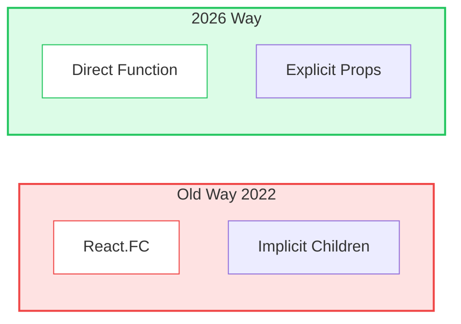
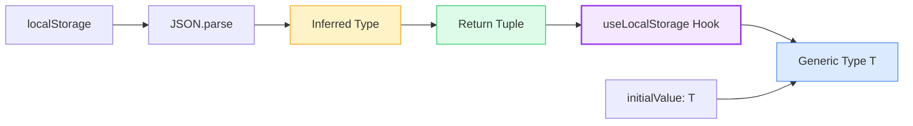
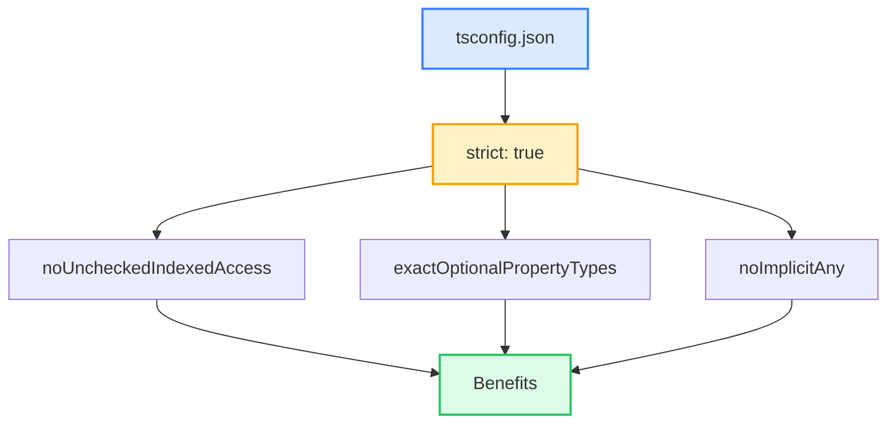

# TypeScript with React: Best Practices (2026)

source: https://medium.com/@mernstackdevdevbykevin/typescript-with-react-best-practices-2026-78ce4546210b
tags: #react #typescript #best-practices #frontend #tsx
date: 2026-02-15
category: 04-Resources/languages

---

## 📊 Diagrams

### 1️⃣ React.FC vs Direct Function



---

### 2️⃣ Generic Component Flow

```mermaid
graph TD
    COMP[Generic List Component]
    TYPE[Type Parameter T]
    PROP[items: T[]]
    RENDER[renderItem: T → ReactNode]
    INF[Type Inference]

    USER[User Usage]
    USERS[users: User[]]
    USER_RENDER[user → span]
    AUTO[Auto Inferred]

    COMP --> TYPE
    COMP --> PROP
    COMP --> RENDER
    TYPE --> INF
    INF --> USER
    USER --> USERS
    USER --> USER_RENDER
    USER_RENDER --> AUTO

    style COMP fill:#dbeafe,stroke:#3b82f6,stroke-width:2px
    style INF fill:#fef3c7,stroke:#f59e0b
    style AUTO fill:#dcfce7,stroke:#22c55e
```

---

### 3️⃣ Discriminated Union State Pattern

```mermaid
graph TD
    STATE[State: LoadingState]
    IDLE[status: idle]
    LOAD[status: loading]
    SUCC[status: success<br/>data: User[]]
    ERR[status: error<br/>error: string]

    CHECK{Type Check}
    IDLE_BRANCH[Show Empty]
    LOAD_BRANCH[Show Spinner]
    SUCC_BRANCH[Show Data]
    ERR_BRANCH[Show Error]

    STATE --> CHECK
    CHECK -->|status === idle| IDLE_BRANCH
    CHECK -->|status === loading| LOAD_BRANCH
    CHECK -->|status === success| SUCC_BRANCH
    CHECK -->|status === error| ERR_BRANCH

    style STATE fill:#dbeafe,stroke:#3b82f6
    style CHECK fill:#fef3c7,stroke:#f59e0b
    style SUCC fill:#dcfce7,stroke:#22c55e
    style ERR fill:#fee2e2,stroke:#ef4444
```

---

### 4️⃣ Custom Hook Type Inference



---

### 5️⃣ Strict Mode Hierarchy



---

## สรุป (Summary)

บทความนี้เป็น **TypeScript + React Best Practices 2026** ซึ่ง highlight patterns ที่ evolved จากปีก่อนๆ เพื่อให้ได้ประโยชน์สูงสุดจาก TypeScript ใน React projects

**Key Stats:**
- TypeScript adoption ใน React projects: **78%** (State of JS 2025)
- Patterns ได้ settle down และ community align กัน

**Why TypeScript + React:**
- ✅ Type safety - ดัก bugs ก่อน runtime
- ✅ Autocomplete superpowers - IDE ช่วยเหลือขณะเขียน
- ✅ Refactor confidently - แก้โค้ดได้อย่างมั่นใจ

---

## Best Practice #1: New JSX Transform

### ❌ Old Way (React 17-)
```tsx
// Must import React in every file
import React from 'react';

interface ButtonProps {
  label: string;
  onClick: () => void;
}

export const Button: React.FC<ButtonProps> = ({ label, onClick }) => {
  return <button onClick={onClick}>{label}</button>;
};
```

### ✅ 2026 Way
```tsx
// No React import needed!
interface ButtonProps {
  label: string;
  onClick: () => void;
  variant?: 'primary' | 'secondary';
}

export const Button = ({ label, onClick, variant = 'primary' }: ButtonProps) => {
  return (
    <button
      onClick={onClick}
      className={`btn-${variant}`}
    >
      {label}
    </button>
  );
};
```

**tsconfig.json:**
```json
{
  "compilerOptions": {
    "jsx": "react-jsx"
  }
}
```

---

## Best Practice #2: Don't Use React.FC

### ❌ Old Way
```tsx
interface CardProps {
  title: string;
}

const Card: React.FC<CardProps> = ({ title, children }) => {
  return <div>{title}{children}</div>;
};
```

**Problems:**
- Implicit children typing
- Unclear props structure
- Extra verbosity

### ✅ 2026 Way
```tsx
interface CardProps {
  title: string;
  children?: React.ReactNode;
}

const Card = ({ title, children }: CardProps) => {
  return <div>{title}{children}</div>;
};
```

**Benefits:**
- ✅ Explicit props control
- ✅ Clearer structure
- ✅ Avoid vagueness

---

## Best Practice #3: Master Generic Components

Generic components ทำ reusable, type-safe components ได้ง่ายกว่าเดิม

```tsx
interface ListProps<T> {
  items: T[];
  renderItem: (item: T) => React.ReactNode;
  keyExtractor: (item: T) => string;
}

const List = <T,>({ items, renderItem, keyExtractor }: ListProps<T>) => {
  return (
    <ul>
      {items.map((item) => (
        <li key={keyExtractor(item)}>{renderItem(item)}</li>
      ))}
    </ul>
  );
};

// Usage with FULL type inference
<List
  items={users}
  renderItem={(user) => <span>{user.name}</span>}
  keyExtractor={(user) => user.id}
/>
```

**Type inference ทำงานอัตโนมัติ:**
- TypeScript รู้ว่า `user` คือ type อะไร
- `renderItem` รับ parameter ถูก type
- IDE autocomplete ทำงานได้เลย

---

## Best Practice #4: Discriminated Unions for State

Handle complex state elegantly ด้วย discriminated unions

```tsx
type LoadingState =
  | { status: 'idle' }
  | { status: 'loading' }
  | { status: 'success'; data: User[] }
  | { status: 'error'; error: string };

const UserList = () => {
  const [state, setState] = useState<LoadingState>({ status: 'idle' });

  // TypeScript knows EXACTLY what's available
  if (state.status === 'success') {
    // ✅ state.data is available here (type-safe!)
    return <div>{state.data.map(...)}</div>;
  }

  if (state.status === 'error') {
    // ✅ state.error is available here
    return <div>Error: {state.error}</div>;
  }

  // ❌ Compile error: state.data doesn't exist here
  return <div>Loading...</div>;
};
```

**Benefits:**
- ✅ Type-safe state handling
- ✅ No `undefined` errors
- ✅ Exhaustive checking
- ✅ IDE autocomplete ตาม state ปัจจุบัน

---

## Best Practice #5: Type Your Hooks Properly

Custom hooks สมควรได้ first-class typing

```tsx
const useLocalStorage = <T,>(key: string, initialValue: T) => {
  const [value, setValue] = useState<T>(() => {
    const stored = localStorage.getItem(key);
    return stored ? JSON.parse(stored) : initialValue;
  });

  return [value, setValue] as const; // Tuple type inference
};

// Usage
const [name, setName] = useLocalStorage('name', 'Guest');
// TypeScript knows:
// - name: string
// - setName: (value: string | ((prev: string) => string)) => void
```

**Key Points:**
- `<T,>` - Generic type parameter พร้อม comma
- `useState<T>` - Initial value ถูก type
- `as const` - Tuple type inference (ไม่ใช่ array)

---

## Best Practice #6: Strict Mode Is Your Friend

Enable ใน `tsconfig.json`:

```json
{
  "compilerOptions": {
    "strict": true,
    "noUncheckedIndexedAccess": true,
    "exactOptionalPropertyTypes": true
  }
}
```

### What Each Setting Does

**strict: true**
- Turns on ALL strict checks
- Mode: เปิดการตรวจสอบทั้งหมด

**noUncheckedIndexedAccess: true**
- Catches array access bugs
- Mode: ดัก bugs จากการ access array ที่ไม่มี

**exactOptionalPropertyTypes: true**
- Distinguish `undefined` vs absent
- Mode: เห็นความต่างระหว่าง undefined กับไม่มี property

---

## Quick Wins Checklist

### Props
- ✅ **interface** instead of `type` (better error messages)
- ✅ Explicit prop definitions
- ✅ Avoid `React.FC`

### Literals
- ✅ Leverage `as const` for readonly literals
```tsx
const VARIANTS = ['primary', 'secondary'] as const;
type Variant = typeof VARIANTS[number]; // 'primary' | 'secondary'
```

### Validation
- ✅ Use `satisfies` operator
```tsx
const config = {
  theme: 'dark',
} satisfies ThemeConfig;
// Validates type without widening
```

### Event Handlers
- ✅ Explicitly type events
```tsx
const handleClick = (e: React.MouseEvent<HTMLButtonElement>) => {
  // e is typed correctly
};
```

### Runtime Validation
- ✅ Add Zod or similar
```tsx
import { z } from 'zod';

const UserSchema = z.object({
  id: z.string(),
  name: z.string(),
});

type User = z.infer<typeof UserSchema>;
```

---

## Key Takeaways

### 2026 Patterns Summary

| Area | Old Way | 2026 Way |
|------|---------|----------|
| JSX Transform | Import React | No import needed |
| Component Type | `React.FC<Props>` | Direct function |
| Children | Implicit | Explicit `children?: ReactNode` |
| State | Union types | Discriminated unions |
| Generics | Verbose | Simple type inference |

### The Bottom Line

**With TypeScript + React:**
- Developer experience ไม่มีตัวตา
- Patterns ได้ settle แล้ว
- Tooling แข็งมาก
- Community align กันที่ best practices

**Enable strict mode → adopt modern patterns → TypeScript จะหา bugs ให้ก่อน users เจอ**

**Benefits:**
- ✅ Maintainable code
- ✅ Scalable architecture
- ✅ Pleasure to use

---

## Related Topics

- #react #typescript #tsx
- #frontend #web-development
- #type-safety #best-practices
- #hooks #components
- #zod #validation

## Notes

**2026 = TypeScript + React Maturity:**

Patterns ได้ evolve จาก 2022:
- No React import ในทุก file
- Reject React.FC (too implicit)
- Embrace generics (simple & powerful)
- Discriminated unions for state
- Strict mode เป็น default

**Start with strict mode today - your future self will thank you!**

> "TypeScript has been getting adopted more and more within React projects by professional developers, with adoption rates recently hitting 78% (State of JS 2025)."
